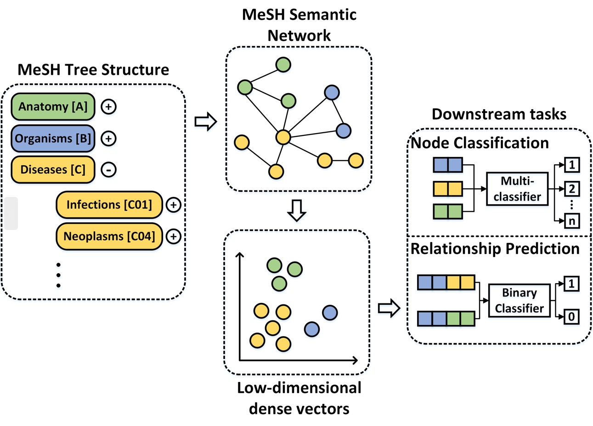
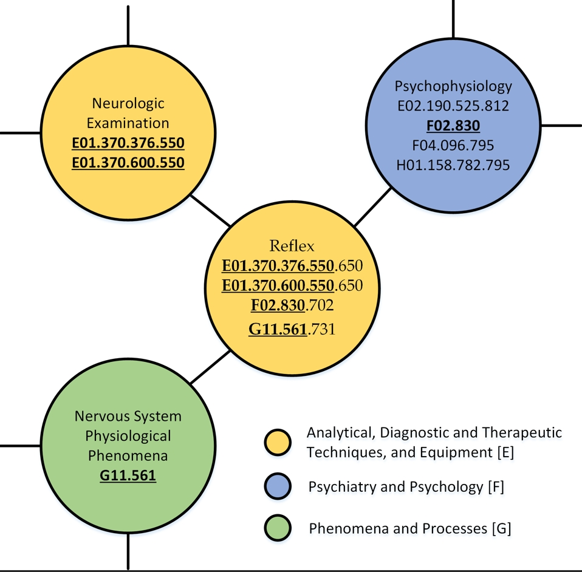
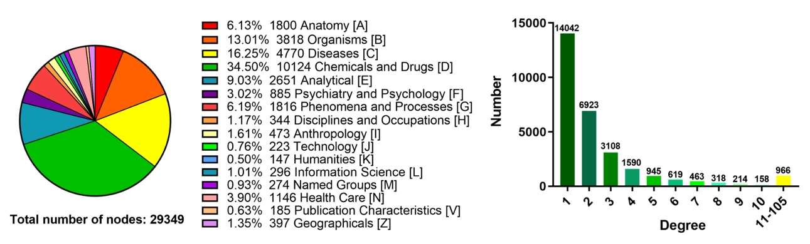

# MeSHHeading2vec

## Overview
Background: 
Effectively representing Medical Subject Headings (MeSH) headings (terms) such as disease and drug as discriminative
vectors could greatly improve the performance of downstream computational prediction models. However, these terms are
often abstract and difficult to quantify. In this paper, we converted the MeSH tree structure into a relationship 
network and applied several graph embedding algorithms on it to represent these terms. Specifically, the relationship 
network consisting of nodes (MeSH headings) and edges (relationships), which can be constructed by the tree num. Then, 
five graph embedding algorithms including DeepWalk, LINE, SDNE, LAP and HOPE were implemented on the relationship 
network to represent MeSH headings as vectors. In order to evaluate the performance of the proposed methods, we carried 
out the node classification and relationship prediction tasks. The results show that the MeSH headings characterized by 
graph embedding algorithms can not only be treated as an independent carrier for representation, but also can be 
utilized as additional information to enhance the representation ability of vectors. Thus, it can serve as an input and 
continue to play a significant role in any computational models related to disease, drug, microbe, etc. Besides, our 
method holds great hope to inspire relevant researchers to study the representation of terms in this network perspective.

## Doc
The BenchmarkDataset, Embedding Vectors and MeSHHeadingRelationshipNetwork can be found in each file.

## Reference:

If you find the data is useful for your research, please consider citing the following paper:

Zhen-Hao Guo, Zhu-Hong You, De-Shuang Huang, Hai-Cheng Yi, Kai Zheng, Zhan-Heng Chen, Yan-Bin Wang, MeSHHeading2vec: 
a new method for representing MeSH headings as vectors based on graph embedding algorithm, Briefings in 
Bioinformatics, bbaa037, https://doi.org/10.1093/bib/bbaa037